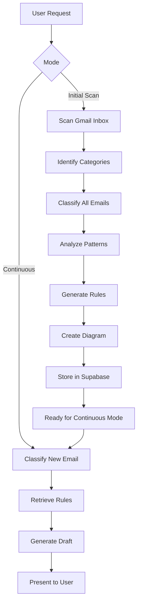

# Email AI Agent 📧🤖

An intelligent email management system built with LangGraph Deep Agents that automatically categorizes your inbox, learns communication patterns, and generates contextually appropriate draft responses.

## 🌟 Features

- **Intelligent Inbox Scanning**: Analyzes your entire Gmail inbox to identify natural categories and subcategories
- **Automatic Categorization**: Classifies emails into learned categories (Work, Hockey Teams, Personal, etc.)
- **Pattern Learning**: Analyzes communication patterns (tone, formality, length, common phrases) for each category
- **Smart Draft Generation**: Automatically generates contextually appropriate responses based on learned patterns
- **Visual Insights**: Creates Mermaid diagrams showing your inbox structure
- **Full Observability**: Complete tracing via LangSmith for transparency and debugging
- **MCP Integration**: Uses Model Context Protocol for seamless Gmail and Supabase connectivity

## 🏗️ Architecture

### Technology Stack

- **LangGraph Deep Agents**: Complex task planning with sub-agents and file system support
- **Gmail MCP Server**: Automatic email tool discovery and integration
- **Supabase MCP Server**: Database operations via natural language
- **Claude Sonnet 4.5**: Advanced language understanding and generation
- **LangSmith**: Full observability and tracing

### How It Works



## 📋 Prerequisites

- Python 3.11 or higher
- Gmail account with API access
- Supabase account with project set up
- Anthropic API key (for Claude)
- LangSmith account (optional but recommended)

## 🚀 Quick Start

### 1. Clone and Setup

```bash
# Clone the repository (or navigate to this directory)
cd "Email Agent LangChain"

# Create virtual environment
python -m venv venv

# Activate virtual environment
# On macOS/Linux:
source venv/bin/activate
# On Windows:
# venv\Scripts\activate

# Install dependencies
pip install -r requirements.txt
```

### 2. Set Up Gmail MCP Server

You have multiple options for Gmail MCP servers. We recommend using `mcp-server-gmail`:

**Option A: Using uvx (Recommended)**
```bash
# Install uvx if you don't have it
pip install uvx

# Test the Gmail MCP server
uvx mcp-server-gmail --help
```

**Option B: Using a specific implementation**
```bash
# Install from GitHub
pip install git+https://github.com/jeremyjordan/mcp-gmail.git

# Or another implementation
pip install git+https://github.com/GongRzhe/Gmail-MCP-Server.git
```

**Gmail OAuth2 Setup**
1. Go to [Google Cloud Console](https://console.cloud.google.com/)
2. Create a new project or select existing one
3. Enable Gmail API
4. Create OAuth 2.0 credentials (Desktop app)
5. Download credentials and complete OAuth flow

### 3. Set Up Supabase

**Create Supabase Project**
1. Go to [Supabase Dashboard](https://app.supabase.com/)
2. Create a new project
3. Note your project URL and API keys

**Run Database Schema**
1. In Supabase Dashboard, go to SQL Editor
2. Copy contents of `supabase/schema.sql`
3. Run the SQL to create all tables

**Get MCP OAuth Token**
1. Go to [Supabase Account Tokens](https://supabase.com/dashboard/account/tokens)
2. Create a new token for MCP access
3. Copy the token (starts with `sbp_`)

### 4. Configure Environment Variables

```bash
# Copy the example environment file
cp .env.example .env

# Edit .env and fill in your credentials
nano .env  # or use your preferred editor
```

**Required Variables:**
```bash
ANTHROPIC_API_KEY=sk-ant-xxxxx
SUPABASE_OAUTH_TOKEN=sbp_xxxxx
SUPABASE_URL=https://your-project.supabase.co
SUPABASE_KEY=your-anon-key
LANGSMITH_API_KEY=lsv2_pt_xxxxx  # Optional
LANGSMITH_TRACING=true
LANGSMITH_PROJECT=email-ai-agent
```

### 5. Run the Agent

**Test Locally:**
```bash
python agent.py
```

**Deploy with LangGraph:**
```bash
# Install LangGraph CLI
pip install langgraph-cli

# Start local development server
langgraph dev

# Or deploy to LangSmith
langgraph deploy
```

## 📖 Usage

### Initial Inbox Scan

When you first run the agent, perform an initial scan to learn about your inbox:

```python
from agent import create_email_agent
import asyncio

async def initial_scan():
    agent = await create_email_agent()

    response = agent.invoke({
        "messages": [{
            "role": "user",
            "content": """
                Please scan my entire Gmail inbox and:
                1. Identify all email categories
                2. Classify all emails
                3. Analyze communication patterns
                4. Generate response rules
                5. Show me a diagram of my inbox structure
            """
        }]
    })

    print(response["messages"][-1].content)

asyncio.run(initial_scan())
```

**Expected Output:**
```
✅ Inbox scan completed!

📊 Statistics:
- Total emails scanned: 2,456
- Categories identified: 8
- Subcategories: 15

📁 Categories Found:
1. Work (1,245 emails)
   - Project Alpha (480 emails)
   - Project Beta (320 emails)
   - Meetings (445 emails)

2. Hockey (387 emails)
   - Team A (215 emails)
   - Team B (172 emails)

3. Personal (824 emails)
   - Family (412 emails)
   - Friends (412 emails)

[Mermaid diagram showing inbox structure]
```

### Generate Draft Response

Once the initial scan is complete, the agent can automatically generate drafts:

```python
async def draft_response():
    agent = await create_email_agent()

    response = agent.invoke({
        "messages": [{
            "role": "user",
            "content": """
                I received a new email from john@team-a-hockey.com about practice schedule.
                Please classify it and generate an appropriate draft response.
            """
        }]
    })

    print(response["messages"][-1].content)

asyncio.run(draft_response())
```

**Expected Output:**
```
📧 Email Classification:
- Category: Hockey > Team A
- Confidence: 0.95

✍️ Draft Response:

Subject: Re: Practice schedule

Hey John,

Thanks for sending over the updated practice schedule! I've added it to my calendar.

Looking forward to Tuesday's session. See you on the ice!

Cheers,
[Your name]

---
ℹ️ This response follows Team A communication patterns:
- Casual, friendly tone
- Brief (2-3 sentences)
- Uses common phrases like "See you on the ice"
- Matches typical greeting/closing style
```

## 🔧 Configuration

### Adjusting Scan Scope

Edit `agent.py` to change the scanning behavior:

```python
# In the system prompt, modify instructions:
# - For testing: "Scan last 100 emails only"
# - For production: "Scan entire inbox history"
```

### Custom Categories

You can pre-seed categories in Supabase:

```sql
INSERT INTO email_categories (name, description) VALUES
    ('Work', 'Work-related emails'),
    ('Personal', 'Personal correspondence'),
    ('Hockey', 'Hockey team communications');
```

### Batch Processing

For very large inboxes, the agent automatically batches emails:

```python
# The agent will process in batches and write to files
# Batch size is configurable in .env:
EMAIL_BATCH_SIZE=200
```

## 📊 Database Schema

The agent uses the following Supabase tables:

- **email_categories**: Hierarchical category structure
- **communication_patterns**: Learned patterns per category
- **response_rules**: Drafting rules per category
- **email_classifications**: Email-to-category mappings
- **generated_drafts**: History of generated drafts
- **inbox_scan_metadata**: Scan tracking

See `supabase/schema.sql` for full schema details.

## 🎯 Advanced Usage

### Using Sub-Agents

The Deep Agent can spawn specialized sub-agents:

```python
# The agent automatically uses sub-agents when appropriate:
# - Category Analyzer: Identifies patterns and creates categories
# - Pattern Analyzer: Analyzes communication styles
# - Draft Writer: Generates responses
```

### File System for Context Management

Large email batches are automatically written to files:

```python
# Files are stored in agent state and managed automatically
# You can read them using the agent's file system tools
```

### LangSmith Tracing

View complete execution traces in LangSmith:

1. Go to [smith.langchain.com](https://smith.langchain.com/)
2. Select your project (`email-ai-agent`)
3. View detailed traces of:
   - Email classification decisions
   - Pattern analysis
   - Draft generation
   - Database operations

## 🔒 Security Best Practices

### Supabase MCP Security

⚠️ **Important**: Supabase MCP is designed for **development and testing only**, not production data.

- **Never connect to production email data** through MCP
- Use **read-only mode** if you must connect to real data
- **Scope access** to a specific project
- Store credentials in `.env`, **never commit** to version control

### Gmail API

- Use OAuth 2.0 for authentication
- Store refresh tokens securely
- Limit API scopes to minimum required
- Monitor API usage quotas

### Environment Variables

```bash
# Never commit .env file
echo ".env" >> .gitignore

# Use secrets management in production
# - AWS Secrets Manager
# - Google Secret Manager
# - Azure Key Vault
```

## 🐛 Troubleshooting

### Gmail MCP Connection Issues

```bash
# Test Gmail MCP server manually
uvx mcp-server-gmail --help

# Check OAuth credentials
# Ensure client_id and client_secret are correct

# Re-authorize if needed
# Delete token file and re-run OAuth flow
```

### Supabase Connection Issues

```bash
# Test Supabase connection
curl https://your-project.supabase.co/rest/v1/ \
  -H "apikey: your-anon-key"

# Verify MCP token
# Token should start with sbp_ and be valid

# Check schema
# Run schema.sql to ensure all tables exist
```

### Agent Not Finding Tools

```bash
# The agent auto-discovers tools from MCP servers
# Check MCP server logs for connection issues

# Verify tools are loaded:
python -c "
import asyncio
from agent import get_mcp_tools
tools = asyncio.run(get_mcp_tools())
print(f'Found {len(tools)} tools')
"
```

## 📁 Project Structure

```
Email Agent LangChain/
├── agent.py                 # Main Deep Agent with MCP integration
├── langgraph.json           # LangGraph deployment config
├── requirements.txt         # Python dependencies
├── .env.example             # Environment variable template
├── README.md                # This file
├── tools/
│   └── mermaid_generator.py # Mermaid diagram tool
└── supabase/
    └── schema.sql           # Database schema
```

## 🤝 Contributing

Contributions are welcome! Areas for improvement:

- Additional MCP server integrations
- More sophisticated pattern analysis
- Multi-language support
- Advanced categorization algorithms
- UI dashboard for visualization

## 📝 License

This project is open source and available under the MIT License.

## 🙏 Acknowledgments

Built with:
- [LangGraph](https://github.com/langchain-ai/langgraph) - Agentic workflows
- [Deep Agents](https://docs.langchain.com/labs/deep-agents) - Complex task handling
- [Model Context Protocol](https://modelcontextprotocol.io/) - Tool standardization
- [Supabase](https://supabase.com/) - Database and storage
- [Anthropic Claude](https://www.anthropic.com/) - Language understanding

## 📧 Support

For issues and questions:
- Open an issue on GitHub
- Check LangGraph documentation: https://docs.langchain.com/langgraph
- Join LangChain Discord community

---

**Happy Email Management! 🎉**
